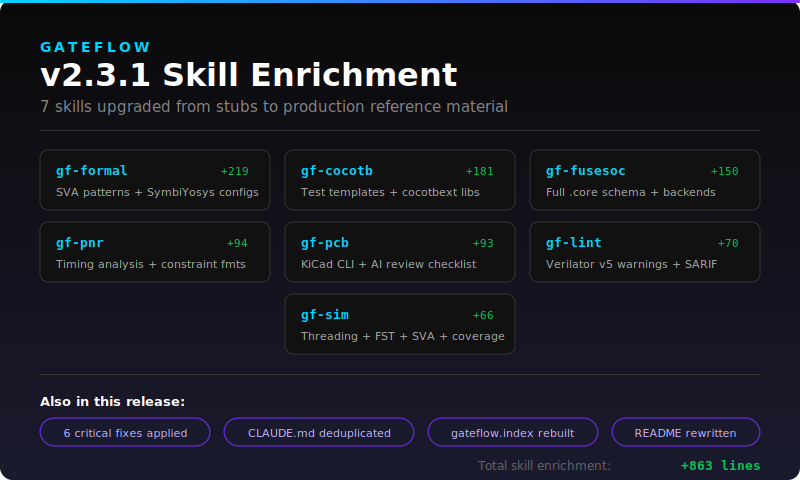

# GateFlow

**The open-source AI hardware platform.** Design, verify, synthesize, and deploy working RTL from natural language. 20 agents. 25 skills. 8 verified IP blocks. One command.

```bash
claude plugin add codejunkie99/Gateflow-Plugin
```

> Say what you want to build. GateFlow plans it, builds it in parallel, lints it, simulates it, and hands you working code.



---

## What It Does

**End-to-end RTL development.** Not just code generation — full verification loops that iterate until your design actually works.

```
"Create a FIFO with AXI-Stream interface and test it"

  /gf asks requirements → plans architecture → spawns parallel agents
    → generates RTL → lints (Verilator) → fixes warnings automatically
    → creates self-checking testbench → simulates → fixes failures
    → delivers lint-clean, sim-passing code
```

**Formal verification from English.** Describe what to prove, get SVA properties + SymbiYosys proofs.

```
"Prove the FIFO never overflows" → SVA assertions + .sby config + proof result
```

**Synthesis + Place & Route.** Target real hardware with open-source tools.

```
"Synthesize for iCEBreaker" → Yosys → nextpnr → bitstream → flash
```

---

## The Stack

### 20 Agents

| Agent | What It Does |
|-------|-------------|
| `sv-codegen` | Synthesizable RTL from specs |
| `sv-testbench` | Self-checking testbenches |
| `sv-debug` | Root-cause simulation failures |
| `sv-verification` | SVA assertions + coverage |
| `sv-formal` | Formal proofs (SymbiYosys) |
| `sv-synth` | Yosys synthesis optimization |
| `sv-refactor` | Lint fixes, code cleanup |
| `sv-planner` | Architecture plans before code |
| `sv-developer` | Complex multi-file changes |
| `sv-orchestrator` | Parallel component builds |
| `sv-understanding` | Code explanation + analysis |
| `sv-tutor` | Interactive SV teaching |
| `sv-viz` | Terminal hierarchy/FSM diagrams |
| `sv-pinmap` | Board-aware pin constraints |
| `sv-ip-scanner` | Auto-detect missing IP + CDC issues |
| `vhdl-codegen` | VHDL-2008 generation (GHDL) |
| `vhdl-testbench` | VHDL testbenches |
| `pcb-designer` | KiCad schematic + PCB |
| `gf-auditor` | Plugin health checks |
| `gf-pluginfixer` | Auto-fix plugin issues |

### 25 Skills

| Category | Skills |
|----------|--------|
| **Orchestration** | `/gf` (main), `/gf-build` (parallel), `/gf-router`, `/gf-expand` |
| **Planning** | `/gf-plan`, `/gf-architect`, `/gf-project` |
| **Verification** | `/gf-lint`, `/gf-sim`, `/gf-formal`, `/gf-cocotb` |
| **IP & Protocols** | `/gf-ip`, `/gf-ip-detect`, `/gf-protocols` |
| **Hardware** | `/gf-pcb`, `/gf-pnr`, `/gf-pinmap`, `/gf-fusesoc` |
| **Learning** | `/gf-learn`, `/gf-learn-ctx` |
| **Visualization** | `/gf-viz` |
| **Reference** | `tb-best-practices`, `/gf-build` |

### 19 Commands

| Command | Description |
|---------|-------------|
| `/gf-lint` | Verilator lint with structured output |
| `/gf-sim` | Compile + simulate with Verilator |
| `/gf-fix` | Auto-fix lint warnings |
| `/gf-gen` | Scaffold modules and testbenches |
| `/gf-scan` | Index project files |
| `/gf-map` | Map codebase architecture |
| `/gf-doctor` | Check environment + dependencies |
| `/gf-formal` | Formal verification (SymbiYosys) |
| `/gf-ip` | Manage verified IP library |
| `/gf-detect` | Scan for missing IP + CDC issues |
| `/gf-boards` | Query board pinouts |
| `/gf-pinmap` | Generate constraint files |
| `/gf-pnr` | Place & route (nextpnr) |
| `/gf-flash` | Program FPGA (openFPGALoader) |
| `/gf-pcb` | Generate KiCad schematic/PCB |
| `/gf-cocotb` | Python testbenches (Cocotb) |
| `/gf-fusesoc` | FuseSoC .core files |
| `/gf-demo` | Interactive demo |
| `/gf-audit` | Plugin health audit |

### 8 Verified IP Blocks

Every block ships with RTL + testbench + formal properties + docs.

| Block | Description |
|-------|-------------|
| `fifo_sync` | Synchronous FIFO (parameterized) |
| `fifo_async` | Async FIFO with Gray code CDC |
| `cdc_2ff` | 2-flip-flop synchronizer |
| `cdc_handshake` | Multi-bit handshake synchronizer |
| `uart` | UART TX+RX (configurable baud) |
| `spi_master` | SPI master (all 4 modes) |
| `axi4lite_slave` | AXI4-Lite register slave |
| `debouncer` | Button debouncer + edge detect |

### 4 Board Configs

Pre-verified pin assignments with full constraint files.

| Board | FPGA | Constraint |
|-------|------|-----------|
| Arty A7-35T | Xilinx XC7A35T | `.xdc` |
| Basys 3 | Xilinx XC7A35T | `.xdc` |
| iCEBreaker | Lattice iCE40UP5K | `.pcf` |
| Tang Nano 9K | Gowin GW1NR-9C | `.cst` |

---

## How It Works

```
User request
     |
     v
  /gf (orchestrator)
     |
     +-- Ask clarifying questions
     +-- Plan with sv-planner (architecture, FSMs, interfaces)
     +-- Build with sv-orchestrator (parallel agent dispatch)
     |      |
     |      +-- sv-codegen (module 1) --+
     |      +-- sv-codegen (module 2) --+-- parallel
     |      +-- sv-testbench -----------+
     |
     +-- Verify
     |      +-- gf-lint --> if FAIL --> sv-refactor --> re-lint
     |      +-- gf-sim  --> if FAIL --> sv-debug --> sv-refactor --> re-sim
     |
     +-- Deliver working, lint-clean, tested code
```

**Every fix goes through agents.** No direct edits. Structured result blocks (`GATEFLOW-RESULT`) drive the loop. Max 3 retries before asking for human guidance.

---

## Supported Tools

| Tool | Purpose | Install |
|------|---------|---------|
| **Verilator** | Lint + simulation | `brew install verilator` |
| **Yosys** | Synthesis | `brew install yosys` |
| **nextpnr** | Place & route | `brew install nextpnr` |
| **SymbiYosys** | Formal verification | `pip install symbiyosys` |
| **openFPGALoader** | FPGA programming | `brew install openfpgaloader` |
| **KiCad** | PCB design | `brew install --cask kicad` |
| **Cocotb** | Python testbenches | `pip install cocotb` |
| **GHDL** | VHDL simulation | `brew install ghdl` |

Run `/gf-doctor` to check what's installed.

---

## Quick Start

```bash
# Install
claude plugin add codejunkie99/Gateflow-Plugin

# Check environment
/gf-doctor

# Build something
/gf create a 4-bit counter with testbench

# Plan first, build second
/gf-plan design a UART controller

# Verify formally
/gf-formal prove the counter never overflows

# Target real hardware
/gf-pnr synthesize and place for iCEBreaker
```

---

## License

[BSL-1.1](LICENSE)

Built by [@Av1dlive](https://x.com/Av1dlive)
