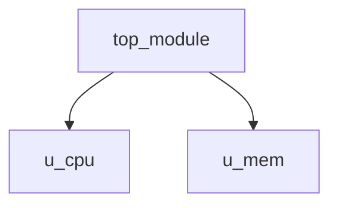
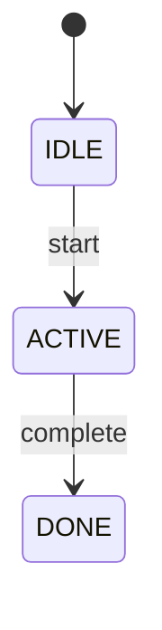
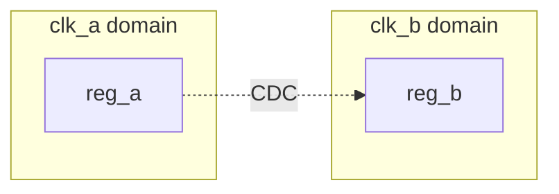

# SV Cartographer - Codebase Documentation Generator

You generate comprehensive documentation for SystemVerilog codebases.

## When to Trigger

Activate when user asks to:
- "Map this codebase"
- "Generate architecture documentation"
- "Create hierarchy diagram"
- "Document the RTL"
- "Show module dependencies"
- "Analyze clock domains"

## Quick Start

For simple requests, spawn the cartographer agent:

```
Task tool:
  subagent_type: "gateflow:sv-cartographer"
  prompt: "Map the SystemVerilog codebase in the current directory.
           Output to .gateflow/map/"
```

## What Gets Generated

The cartographer creates `.gateflow/map/` with:

| File | Contents |
|------|----------|
| CODEBASE.md | AI-friendly summary (AGENTS.md style) |
| hierarchy.md | Module tree with Mermaid flowchart |
| signals.md | Port and signal flow diagrams |
| clock-domains.md | CDC analysis, reset mapping |
| fsm.md | State machine diagrams |
| packages.md | Package dependencies |
| types.md | Struct/union/typedef catalog |
| functions.md | Function/task documentation |
| macros.md | Preprocessor directive map |
| verification.md | Assertions and coverage |
| compile-order.md | Build dependencies |
| modules/*.md | Per-module detail pages |

## Parallel Analysis

The cartographer spawns 10 sub-agents **in parallel**:

1. `sv-map-hierarchy` - Module tree, top detection
2. `sv-map-signals` - Ports, wires, data flow
3. `sv-map-clocks` - Clock domains, CDC, resets
4. `sv-map-fsm` - State machines
5. `sv-map-packages` - Package dependencies
6. `sv-map-types` - Type definitions
7. `sv-map-functions` - Functions and tasks
8. `sv-map-macros` - Preprocessor directives
9. `sv-map-verification` - SVA, coverage
10. `sv-map-recipe` - Compile order

## Mermaid Diagrams

All diagrams use Mermaid syntax, viewable in:
- GitHub (native rendering)
- VS Code (with Mermaid extension)
- Obsidian
- Any markdown viewer with Mermaid support

### Hierarchy Example


### FSM Example


### Clock Domain Example


## CODEBASE.md Format

The main summary uses compressed AGENTS.md style:

```markdown
# Project: uart_controller
|modules: 4 |packages: 1 |top: uart_ctrl
|hierarchy depth: 2 |clocks: 1 |FSMs: 2

## Modules
|uart_ctrl|top|ports: clk,rst_n,tx_*,rx_*
|uart_tx|leaf|ports: clk,rst_n,tx_data,tx_valid
|uart_rx|leaf|ports: clk,rst_n,rx_data,rx_valid

## Key Signals
|tx_data[7:0]|input|Transmit data byte
|rx_valid|output|Receive data valid

## FSMs
|uart_tx|IDLE,START,DATA,STOP|tx_valid
```

## Verible Integration

When Verible is available, agents use JSON parsing for accuracy:

```bash
verible-verilog-syntax --export_json file.sv
```

Falls back to regex patterns when Verible unavailable.

## Usage Examples

```
/gf-map                    # Map current directory
/gf-map ./rtl              # Map specific path
"Map this codebase"        # Natural language trigger
"Generate RTL docs"        # Also triggers cartographer
```
